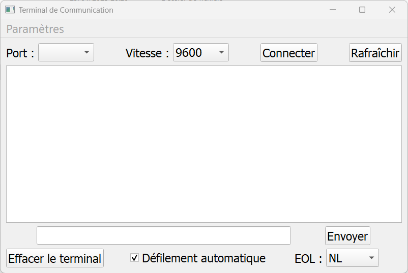

# Terminal Série

serial_terminal est une application de terminal série avec une interface graphique utilisant PyQt5. Il permet de se connecter à un port série, d'envoyer et de recevoir des données, et d'afficher les messages dans une interface utilisateur.

## Exécuter le script d'installation

Utilisez le script batch `install_serial_terminal.bat` pour installer les dépendances.  
Si l'installation est réussi le fichier `serial_terminal.txt` sera modifié en programme python sans console `serial_terminal.pyw` 

## Utilisation

+ Double cliquez sur le fichier `serial_terminal.pyw`  

ou

+ Ouvrez une invite de commande, naviguez jusqu'au répertoire contenant les fichiers, puis exécutez le script batch :
   ```
   python serial_terminal.pyw

## Visualisation
# Terminal Série

serial_terminal est une application de terminal série avec une interface graphique utilisant PyQt5. Il permet de se connecter à un port série, d'envoyer et de recevoir des données, et d'afficher les messages dans une interface utilisateur.

## Exécuter le script d'installation

Utilisez le script batch `install_serial_terminal.bat` pour installer les dépendances.  
Si l'installation est réussi le fichier `serial_terminal.txt` sera modifié en programme python sans console `serial_terminal.pyw` 

## Utilisation

+ Double cliquez sur le fichier `serial_terminal.pyw`  

ou

+ Ouvrez une invite de commande, naviguez jusqu'au répertoire contenant les fichiers, puis exécutez le script batch :
    ```
    python serial_terminal.pyw
    ```

## Visualisation


